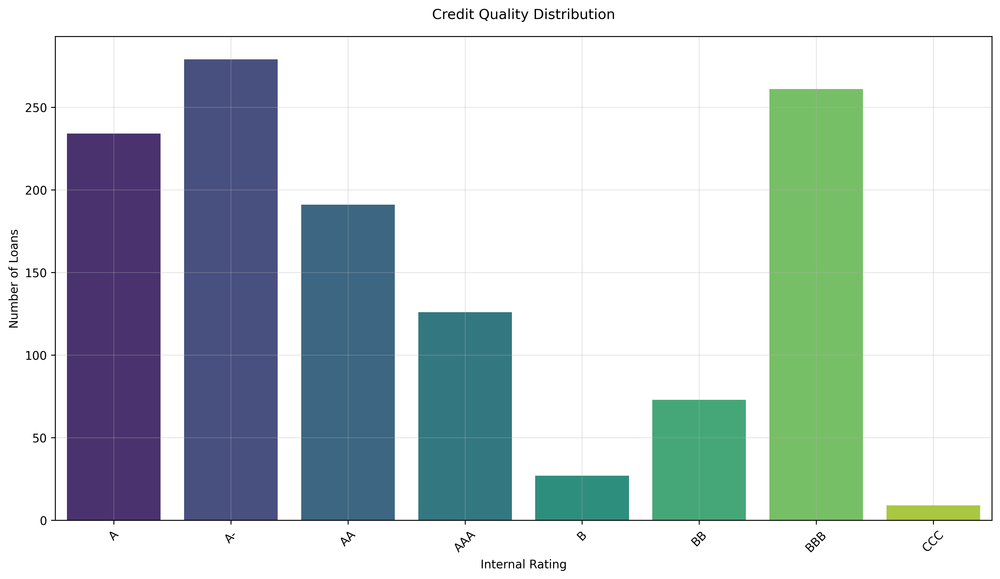
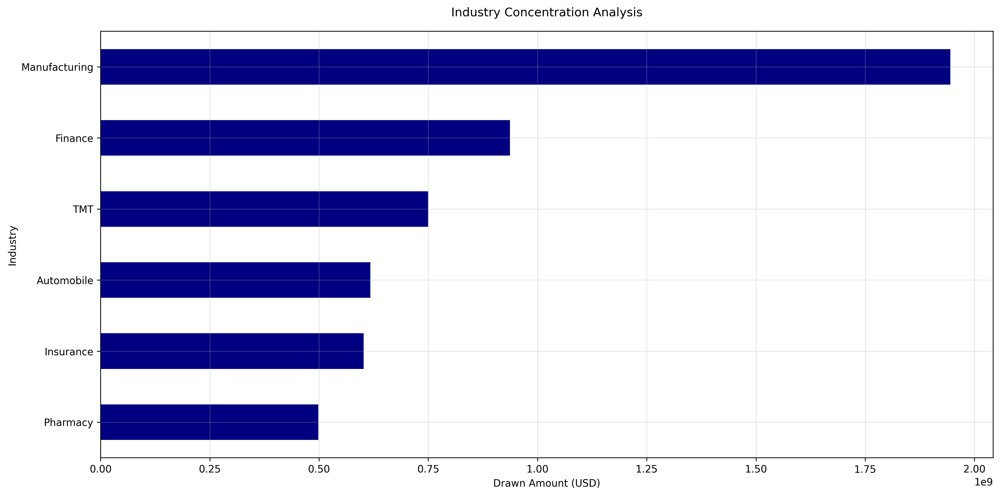
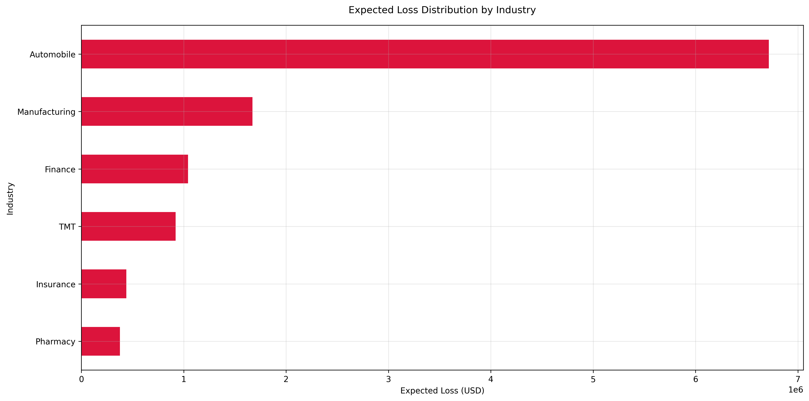

# CTC Risk Innovation - Loan Portfolio Analysis

## Overview
This project analyzes a synthetic loan portfolio containing 1,200 loans to evaluate its risk profile and estimate potential credit losses. The analysis includes data cleaning, exploratory data analysis, and risk quantification using industry-standard metrics.

## Analysis Components

### 1. Data Cleaning (`clean_data.py`)
- Handles data preprocessing and cleaning of the raw loan dataset
- Removes duplicates and handles missing values
- Standardizes data formats and column names
- Generates a cleaned dataset for further analysis

### 2. Risk Analysis (`app.py`)
Performs comprehensive risk analysis through three main visualizations:

#### a) Internal Rating Distribution

- Shows the distribution of loans across different internal rating categories
- Helps identify concentration risk in specific rating bands
- Critical for understanding the overall credit quality of the portfolio

#### b) Industry Exposure Analysis

- Visualizes total drawn amounts by industry
- Identifies potential sector concentrations
- Crucial for managing sector-specific risks

#### c) Expected Loss by Industry

- Combines Probability of Default (PD), Loss Given Default (LGD), and Exposure
- Shows expected losses across different industries
- Essential for risk-based capital allocation and provisioning

## Risk Estimation Methodology

### Expected Loss Calculation
The model uses three key components:
1. **Probability of Default (PD)**: Based on internal ratings (ranging from 0.02% for AAA to 20% for CCC)
2. **Loss Given Default (LGD)**: Industry-specific loss rates (ranging from 35% for Insurance to 60% for TMT)
3. **Exposure At Default (EAD)**: Using drawn amounts as the exposure metric

Formula: `Expected Loss = PD × LGD × EAD`

## Requirements
- Python 3.x
- pandas
- matplotlib
- seaborn

## Usage
1. First, run the data cleaning script:
   ```bash
   python clean_data.py
   ```

2. Then run the analysis script:
   ```bash
   python app.py
   ```

## Results
The analysis provides:
- Portfolio composition insights
- Risk concentration identification
- Expected loss estimates by industry
- Visual representations of key risk metrics

## Notes
- All monetary values are in USD
- Default probabilities are annual estimates
- LGD values are based on historical industry averages
